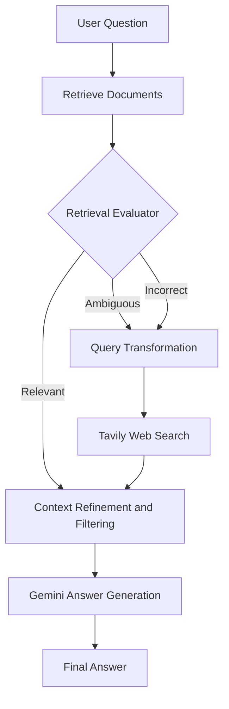

# Corrective RAG (CRAG) Assistant

A self-correcting Retrieval-Augmented Generation (RAG) system that evaluates retrieved context **before** generating an answer, and falls back to web search when retrieval is weak. The goal is reliable question answering with fewer hallucinations.

## Problem

Standard RAG blindly trusts whatever the retriever returns. If the retrieved documents are irrelevant or incomplete, the LLM still uses them and produces confident but wrong answers.

## Solution

CRAG adds a **retrieval evaluator** between retrieval and generation. Each retrieved document is graded, and the pipeline takes a different path depending on the result:

| Verdict | Action |
|---|---|
| **Relevant** | Refine and filter the context, then generate |
| **Ambiguous** | Refine local context and supplement it with web search |
| **Incorrect** | Discard local context, transform the query, and use web search only |

---

## Architecture



---

## Features

- **Retrieval evaluation:** classifies context quality before it reaches the LLM
- **Query transformation:** rewrites the question into a better search query
- **Web search fallback:** uses Tavily when local retrieval is insufficient
- **Context refinement:** filters out irrelevant sentences and keeps only useful evidence
- **Grounded generation:** the answer is produced only from the cleaned context

---

## Tech Stack

- **Language:** Python
- **Framework:** LangChain
- **Web Search:** Tavily
- **Vector Store:** *(add yours, e.g. FAISS / Chroma)*

---


## Getting Started

### 1. Clone the repository

```bash
git clone https://github.com/vishaMNIT/CRAG.git
cd CRAG
```

### 2. Install dependencies

```bash
python -m venv venv
source venv/bin/activate      # Windows: venv\Scripts\activate
pip install -r requirements.txt
```


## Example

```
Q: What is Corrective RAG?

[Retriever]   Retrieved 4 documents
[Evaluator]   Verdict: AMBIGUOUS
[Rewriter]    Query -> "Corrective RAG CRAG retrieval evaluator explained"
[Web Search]  Fetched 3 results
[Refiner]     Kept 5 relevant passages
[Generator]   Answer generated
```

> Replace this with a real output from your run.

---

## How It Works

1. **Retrieve:** fetch top-k documents for the question.
2. **Evaluate:** an LLM grader scores each document for relevance.
3. **Decide:** based on the scores, choose to use, supplement, or replace the retrieved context.
4. **Correct:** rewrite the query and run a web search if needed.
5. **Refine:** filter the context down to the useful passages.
6. **Generate:** Gemini answers using only the refined context.

---

## Future Improvements

- Add a numeric confidence threshold for the evaluator
- Support PDF and document uploads
- Add a Streamlit or FastAPI interface
- Benchmark against standard RAG on hallucination rate

---

## Reference

Yan et al., *Corrective Retrieval Augmented Generation* (2024), [arXiv:2401.15884](https://arxiv.org/abs/2401.15884)

---
